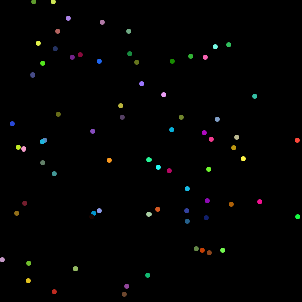

# Random Points Generator

This script generates a series of images with random points. Each image contains a varying number of points, and each point has a random position and color. The images are saved in the specified output folder.

## Features

- Generate images with random colored points
- Customize the number of images and iterations (number of points)
- Save images in PNG or SVG format




## Installation

1. Install [Node.js](https://nodejs.org/en/download/) if you haven't already.
2. Install the dependencies:

```bash
npm install
```

## Usage

1. Open the script in your preferred code editor.
2. Configure the `format` variable to either `'png'` or `'svg'` depending on your desired image format.
3. Run the script:

```bash
node index.js
```

By default, the script will generate 10 images with a random number of points between 5 and 100. The images will be saved in the `./output` folder.

## Customization

You can customize the following variables in the script:

- `width` and `height`: Dimensions of the generated images
- `dir`: Directory where the images will be saved
- `format`: Image format (either 'png' or 'svg')
- `iterations`: Number of points in each image (this can be a fixed number or a random number within a specified range)

To change the number of images, modify the loop in the `main()` function:

```javascript
for (let index = 0; index < 10; index++) {
    // ...
}
```

Replace `10` with your desired number of images.
